# DOS Effects
Old  DOS demo and effects with mode 13h and super vesa mode (VESA 3.0 core functions).
Using Watcom C/C++ compiler and inline ASM code.

Run program by DosBox-X at https://dosbox-x.com/. Any things contact pherosiden@gmail.com

# How to build
Before build, run envir.bat to setup path.
Use build.bat or build32.bat to build source.

# Screenshots

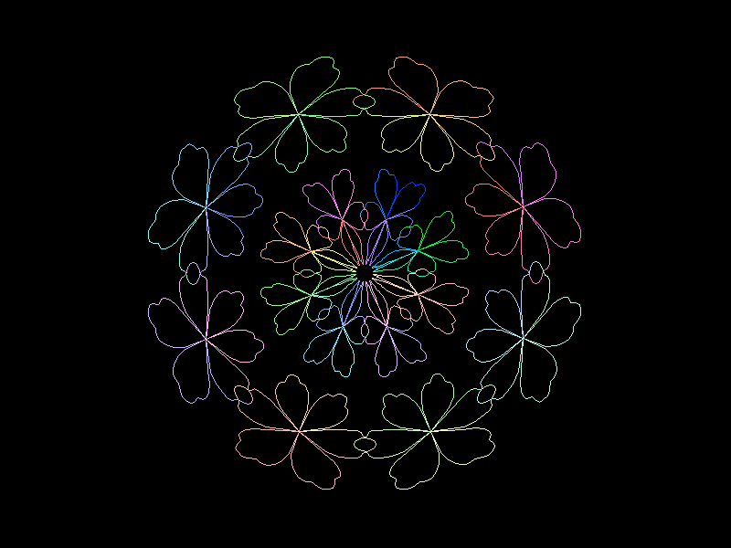

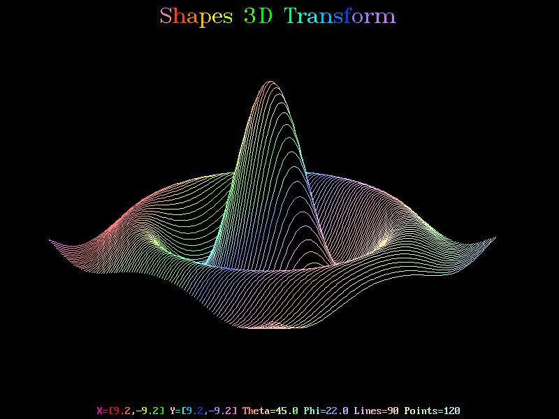

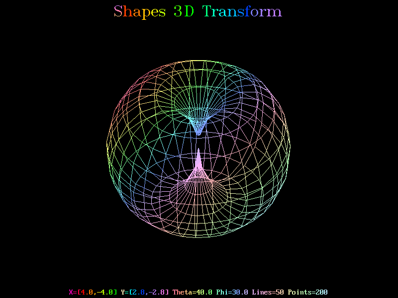

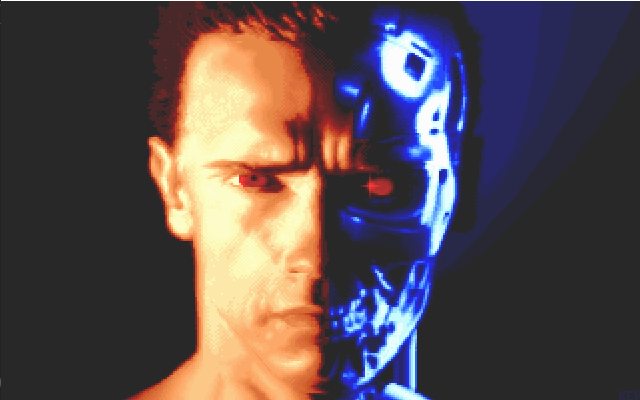

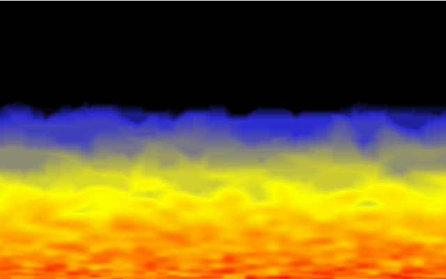

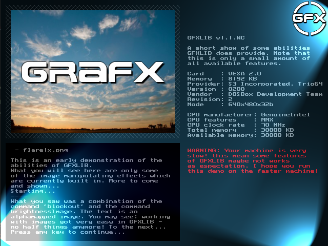

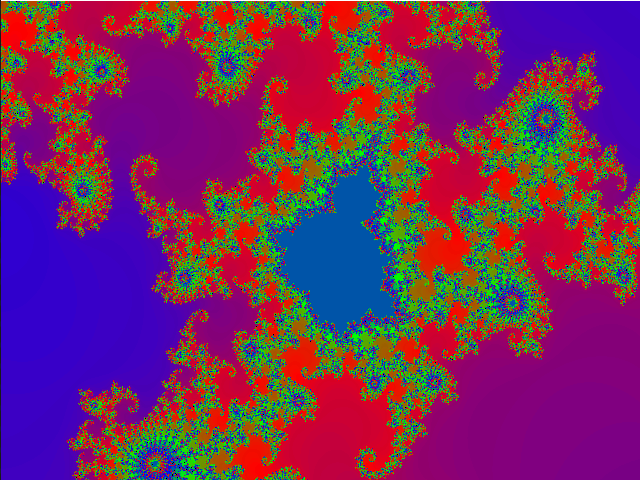

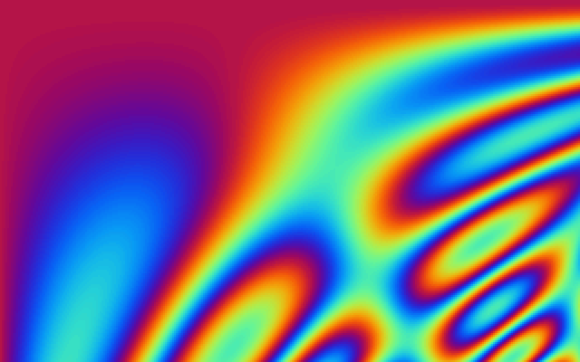

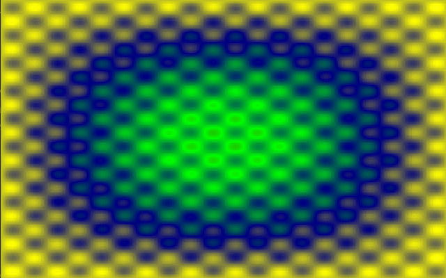

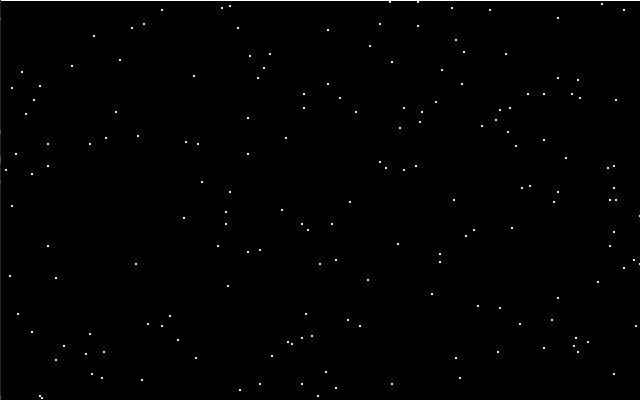

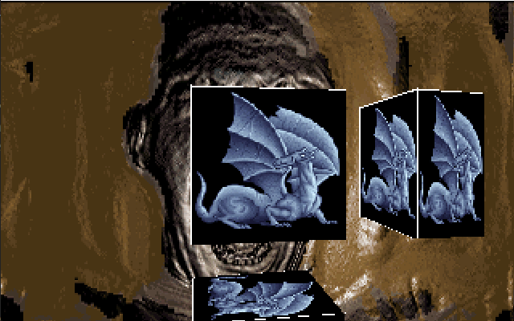

